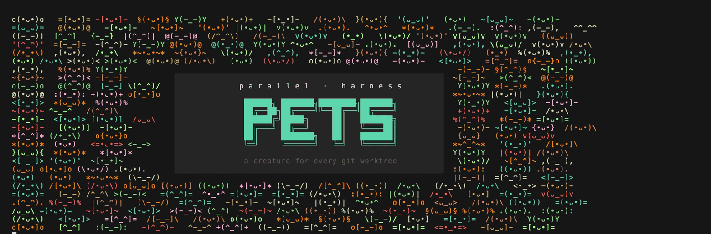
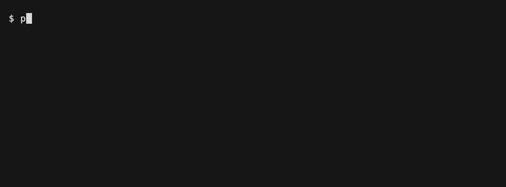
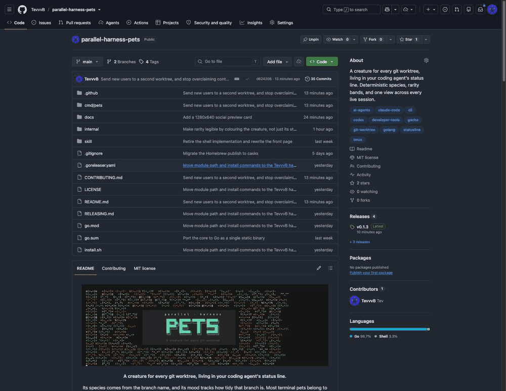

<p align="center">
  
</p>

<p align="center">
  <strong>A creature for every agent, in a den for every git worktree.</strong>
</p>

<p align="center">
  Most terminal pets belong to <i>you</i>: one creature, nurtured over time. This one belongs
  to an <b>agent</b>. Every worktree is a den with a name, every agent working in it gets its
  own creature, and its mood tracks how tidy that worktree is. Six agents means six creatures
  alive at once, each recognisable at a glance, so you always know which session you are
  looking at and which one is in trouble.
</p>

<div align="center">
  <a href="LICENSE"></a>
  <a href="https://github.com/TevvvB/parallel-harness-pets/releases"></a>
  <a href="https://buymeacoffee.com/tevvvb"></a>
  <p><sub><i>If you like, I like coffee :)</i></sub></p>
</div>

<p align="center">
  
</p>

## Install

**Linux and macOS**

```sh
curl -fsSL https://raw.githubusercontent.com/TevvvB/parallel-harness-pets/main/install.sh | sh
pets install
```

**macOS with Homebrew**

```sh
brew install TevvvB/tap/parallel-harness-pets
pets install
```

**Windows** - grab an archive from
[Releases](https://github.com/TevvvB/parallel-harness-pets/releases), put `pets`
on your `PATH`, then run `pets install`.

**With Go** - `go install github.com/TevvvB/parallel-harness-pets/cmd/pets@latest`

`pets install` finds the agents you have and wires itself in, backing up any
config it touches and leaving your other settings alone. Start a new session
afterwards. `pets uninstall` reverses it.

If an agent is installed but has never been run, it has no config directory yet,
so name it directly: `pets install --harness=claude`.

## Star parallel-harness-pets

If a creature in your status line makes running several agents at once a little
easier to keep straight, a star helps other people find it.

<p align="center">
  
</p>

## Updating

| Installed with | Update with |
|---|---|
| Homebrew | `brew upgrade parallel-harness-pets` |
| The install script | re-run it, it replaces the binary in place |
| Go | `go install github.com/TevvvB/parallel-harness-pets/cmd/pets@latest` |
| A release archive | download the new one |

Homebrew refuses to upgrade a cask from a tap it does not trust, so the first
upgrade may stop with *"Refusing to load cask ... from untrusted tap"*. Trust it
once and it will not ask again:

```sh
brew trust TevvvB/tap
```

`pets card`, `pets party` and `pets den` check once a day whether a newer
release exists and print a line if so. Nothing else ever does: no hook and
nothing on the status line path touches the network. Turn it off with
`check = false` under `[update]`.

## Supported agents

| Agent | What you get |
|---|---|
| Claude Code | Full: live status line, hatch, quips |
| Codex CLI | Hooks are written, but untested against a real Codex. Use the shell snippet below for the pet itself |
| tmux or your shell prompt | Full pet, works with **any** agent |
| Editors | `pets render --format=json` to build your own |

The tmux and shell options need nothing from the agent, so they work with Aider,
Amp, Gemini CLI, or anything else. `pets install` prints the snippets.

Claude Code is the only agent this has been verified against end to end. If you
run something else and it works, or does not, please open an issue.

## Reading it

| Glyph | Meaning |
|---|---|
| `@ DXB` | the den: which worktree, as a flight code |
| `•ᴗ•` `•_•` `¬_¬` `>_<` `@_@` `x_x` | mood, five hearts down to zero |
| `7△` | 7 uncommitted files |
| `3↑` | 3 unpushed commits |
| `105↓` | commits behind trunk, shown past 40, costs nothing |
| `⑂2` | 2 heads in one migration tree |
| `✗` | last test or lint run failed |
| `-.-` with `·····` | still waking up, in the first second of a session |

You start at five hearts and lose one for any uncommitted file, another past 15,
one for any unpushed commit, another past 5, and two for a failing test run. All
of it is configurable.

Test results are only recorded when a runner says outright how it went, and a
result older than two hours is forgotten, so a red mark never haunts a branch
you already fixed.

## Seeing every worktree at once

```
  pets party                              4 dens · 3 agents

  @PAR (•_•)     otter ✦     refactor/auth-guard  ♥♥♥♥♡  3△
       (•_•)     otter     fix the flaky auth test               just now
       /•_•\     cat       audit the session middleware          just now
  @SYD -[•_•]-   carp  ✦     spike/wasm-build     ♥♥♥♥♡  9△
       -[•_•]-   carp      port the wasm build to esbuild        just now
  @MEX {•ᴗ•}     fox   ✦     chore/bump-deps      ♥♥♥♥♥
  @IST \(•ᴗ•)/   crow  ✦✦✦   docs/api-reference   ♥♥♥♥♥

  worst: otter · uncommitted
```

Worst first, so whatever needs attention is at the top. Dens with agents in them
list who is there, with the session's own name, so two agents sharing a worktree
are two creatures rather than one. Empty dens still show a creature. Long lists
are trimmed; `pets party --all` shows everything.

## Collecting them

Open a branch you have never opened before and its creature hatches. Species are
banded by rarity:

| Band | Odds | |
|---|---|---|
| common | 60% | `✦` |
| uncommon | 25% | `✦✦` |
| rare | 11% | `✦✦✦` |
| legendary | 3.5% | `✦✦✦✦` |
| mythic | 0.5% | `✦✦✦✦✦` |

Anything rare or above wears its band's colour, so you can see what you rolled
without counting stars. Commons and uncommons take a hue of their own, which is
what keeps two branches on the same creature telling apart.

Shiny is a separate 1-in-128 roll, so even a common can be a find. `pets den`
shows your collection.

A creature belongs to an agent and lasts as long as that session does, so
starting a session is a fresh roll. Dens are the stable half: the same repo and
worktree resolve to the same city on any machine, with nothing stored, and a den
remembers every agent that has worked in it even after they have moved on.

## Commands

| | |
|---|---|
| `pets party [--all]` | every live worktree, worst first |
| `pets den` | your collection |
| `pets card [path]` | full readout for one worktree |
| `pets render [--format=…]` | `statusline`, `tmux`, `title` or `json` |
| `pets install` / `pets uninstall` | wire into your agents |
| `pets version` | |

## Configuration

Optional, in `~/.config/pets/config.toml`.

```toml
[branch]
# Detected from your remote; set only to override.
# default = "origin/trunk"

[update]
# Once a day, and only from card, party and den.
check = true

[score]
dirty_many_at = 15
unpushed_many_at = 5
tests_failing = 2

[display]
party_limit = 12

[signals]
enabled = ["dirty", "unpushed", "behind", "tests"]

# Off by default. Turn on if your project uses Alembic or Django migrations,
# and the pet will warn you when a tree has split into two heads.
[signals.migrations]
enabled = false
penalty = 2
```

### Teaching it your stack

Any executable that prints `key=value` lines is a signal. Drop it in
`~/.config/pets/signals/` and it is scored with the built-in ones. It gets the
worktree path as its first argument.

```sh
#!/bin/sh
# ~/.config/pets/signals/cargo.sh
echo "clippy=$(cargo clippy --message-format=short 2>&1 | grep -c '^warning')"
```

## Contributing

Two things are easy to contribute. A **creature** is one line in a slice, with a
name, the two fragments that bracket its face, and a rarity band. A **signal**
is any executable that prints `key=value`, so teaching the pet to read your
stack takes four lines of shell and no Go at all.

See [CONTRIBUTING.md](CONTRIBUTING.md). Issues and pull requests welcome.

## Licence

MIT. See [LICENSE](LICENSE).
